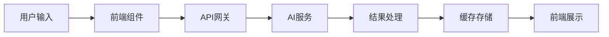

# 黄土高原案例库AI功能集成详细方案

## 1. AI功能总览

### 1.1 功能架构
本方案设计了四大核心AI功能模块：
- **智能搜索**：基于语义理解的案例智能检索
- **AI图片**：智能图片搜索和生成功能
- **内容生成**：AI辅助的内容创作和优化
- **智能助手**：专业的对话和咨询系统

### 1.2 技术特点
- **多服务商策略**：主用OpenAI，备用百度AI等
- **渐进式增强**：在现有功能基础上逐步添加AI能力
- **成本可控**：智能缓存和优化策略控制成本
- **安全合规**：完善的安全措施和合规性保障

## 2. 核心AI功能详细设计

### 2.1 智能案例搜索

#### 功能描述
将传统的关键词搜索升级为基于语义理解的智能搜索系统，用户可以使用自然语言描述查找相关案例。

#### 技术实现
```typescript
// 搜索API示例
POST /api/ai/search
{
  "query": "寻找黄土高原退耕还林成功案例",
  "type": "semantic",
  "filters": {
    "category": "ecological-restoration",
    "location": "黄土高原"
  },
  "limit": 20
}
```

#### 用户体验改进
1. **智能提示**：输入时实时显示搜索建议
2. **语音搜索**：支持语音输入查询
3. **搜索历史**：个性化搜索记录和快速访问
4. **相关推荐**：基于搜索结果推荐相关案例

#### 性能指标
- 搜索响应时间：< 2秒
- 搜索准确率：> 85%
- 用户满意度：> 4.0/5.0

### 2.2 AI图片功能

#### 图片智能搜索
**功能**：根据关键词智能匹配高质量生态主题图片
**数据源**：
- Unsplash API：专业摄影作品
- Pixabay API：免费商用图片
- 自建图片库：专业案例图片

**搜索增强**：
- 图片内容AI识别和自动标注
- 智能裁剪和尺寸调整建议
- 版权信息自动标注和合规检查

#### 图片AI生成
**生成类型**：
- 技术示意图：流程图、原理图
- 效果对比图：治理前后对比
- 专业图标：技术标识和图标
- 文档插图：配图和装饰元素

**风格预设**：
```javascript
const stylePresets = {
  ecological: "绿色主题，自然元素，生态风格",
  technical: "简洁专业，图表样式，技术风格",
  comparison: "前后对比，视觉冲击，对比风格",
  geographic: "地理信息，区域标注，地图风格"
};
```

### 2.3 AI内容生成

#### 案例描述生成
**输入要求**：
- 基本信息：项目名称、地点、规模
- 技术要点：主要技术措施
- 成效数据：量化指标和成果

**输出结构**：
1. 项目背景和问题分析
2. 技术方案和实施过程
3. 项目成效和经验总结
4. 推广价值和应用前景

#### 技术方案分析
**分析维度**：
- 技术可行性分析
- 经济效益评估
- 环境影响分析
- 社会效益评价

#### 报告自动生成
**报告类型**：
- 项目可行性报告
- 实施方案设计
- 阶段性进展报告
- 项目总结评估

### 2.4 智能助手系统

#### 对话能力
- **专业问答**：回答生态治理相关专业问题
- **方案建议**：基于案例库提供技术建议
- **数据查询**：自然语言形式的数据检索
- **知识普及**：生态治理知识科普和教育

#### 对话上下文
- 案例咨询：具体案例的详细信息解答
- 技术讨论：治理技术原理和应用指导
- 政策解读：相关政策标准的解释说明
- 经验分享：成功经验和失败教训总结

## 3. 系统集成架构

### 3.1 前端集成
```vue
<!-- AI搜索组件示例 -->
<template>
  <div class="ai-search-container">
    <AISearchBox 
      v-model="searchQuery"
      :suggestions="searchSuggestions"
      @search="handleAISearch"
      @voice-input="handleVoiceInput"
    />
    <AISearchResults 
      :results="searchResults"
      :loading="isSearching"
      @select="handleResultSelect"
    />
  </div>
</template>
```

### 3.2 后端架构
```typescript
// API路由结构
/api/ai/
├── search.ts          // 智能搜索
├── images/
│   ├── search.ts      // 图片搜索
│   └── generate.ts    // 图片生成
├── content/
│   ├── generate.ts    // 内容生成
│   └── analyze.ts     // 内容分析
└── chat/
    └── assistant.ts   // 智能助手
```

### 3.3 数据流设计


## 4. API接口设计

### 4.1 智能搜索API
```typescript
interface SearchRequest {
  query: string;           // 搜索查询
  type: 'semantic' | 'keyword' | 'hybrid';
  filters?: {
    category?: string;
    location?: string;
    dateRange?: [string, string];
  };
  limit?: number;
}

interface SearchResponse {
  results: Array<{
    id: string;
    title: string;
    summary: string;
    relevance: number;
    highlights: string[];
  }>;
  suggestions: string[];
  total: number;
  queryTime: number;
}
```

### 4.2 图片功能API
```typescript
interface ImageSearchRequest {
  keywords: string;
  style: 'photo' | 'illustration' | 'chart';
  orientation: 'landscape' | 'portrait' | 'square';
  quality: 'standard' | 'high';
}

interface ImageGenerateRequest {
  prompt: string;
  style: string;
  size: '512x512' | '1024x1024';
  steps: number;
}
```

### 4.3 内容生成API
```typescript
interface ContentGenerateRequest {
  type: 'description' | 'analysis' | 'report';
  template: string;
  context: {
    title: string;
    location: string;
    scale: string;
    techniques: string[];
    results: Record<string, any>;
  };
  requirements: {
    length: 'short' | 'medium' | 'long';
    tone: 'formal' | 'casual' | 'technical';
    focus: string[];
  };
}
```

## 5. 实施计划

### 5.1 开发阶段
AI基础设施搭建（2周）
- 任务：AI服务账户注册和配置, API密钥管理系统搭建, 基础AI组件开发, 向量数据库配置
- 交付物：AI服务接入完成, 基础API框架, 测试环境搭建

智能搜索功能开发（3周）
- 任务：语义搜索算法实现, 搜索结果排序优化, 搜索界面集成, 搜索性能测试
- 交付物：AI搜索功能上线, 搜索准确性达标, 用户界面优化

AI图片功能开发（2周）
- 任务：图片搜索API集成, 图片生成功能开发, 图片质量控制, 图片管理界面
- 交付物：AI图片搜索功能, AI图片生成功能, 图片质量保障

AI内容生成功能（3周）
- 任务：内容生成模板设计, AI写作助手开发, 内容质量检查, 编辑界面集成
- 交付物：AI内容生成功能, 智能写作助手, 内容质量保证

系统优化和上线（2周）
- 任务：性能优化和调试, 安全性测试, 用户培训和文档, 生产环境部署
- 交付物：完整AI功能上线, 性能达标, 用户文档完成

### 5.2 总体时间线
- **总开发周期**：12周
- **核心功能上线**：8周
- **完整功能部署**：12周

## 6. 成本分析

### 6.1 月度成本估算
- **低使用量场景**：$50-80/月
  - 适用于初期推广阶段
  - 基础AI功能使用
  
- **中等使用量场景**：$100-150/月
  - 适用于正常运营阶段
  - 全功能AI服务
  
- **高使用量场景**：$200-300/月
  - 适用于高峰期或大规模使用
  - 包含高级AI功能

### 6.2 成本优化策略
1. **智能缓存**：减少60-80%重复API调用
2. **批量处理**：批量操作降低成本20-30%
3. **智能路由**：根据成本选择最优AI服务
4. **使用监控**：实时监控防止成本超标

### 6.3 投资回报分析
**效率提升**：
- 内容创建效率提升70%
- 搜索准确性提升50%
- 用户体验显著改善
- 维护成本降低40%

**商业价值**：
- AI功能差异化竞争优势
- 用户粘性和满意度提升
- 数据价值深度挖掘
- 技术创新品牌形象

## 7. 质量保证

### 7.1 AI功能测试
**搜索准确性测试**：
- 搜索结果相关性评估
- 多语言搜索能力测试
- 边界情况处理测试
- 性能基准测试

**内容质量测试**：
- 生成内容准确性检查
- 专业术语使用正确性
- 内容逻辑一致性验证
- 语言表达质量评估

**图片功能测试**：
- 图片搜索相关性测试
- 生成图片质量评估
- 版权合规性检查
- 加载性能优化测试

### 7.2 集成测试
**API集成测试**：
- API调用成功率测试
- 错误处理机制测试
- 超时处理策略测试
- 限流机制效果测试

**UI集成测试**：
- 组件交互功能测试
- 状态管理正确性测试
- 异步操作稳定性测试
- 用户体验一致性测试

### 7.3 性能测试
**负载测试**：
- 并发用户压力测试
- API响应时间基准
- 系统资源使用率监控
- 缓存机制效果验证

**压力测试**：
- 极限负载承受能力
- 故障恢复机制测试
- 内存泄漏检测
- 长时间运行稳定性

## 8. 安全与合规

### 8.1 API安全
- **身份验证**：基于JWT的用户认证
- **授权控制**：基于角色的API访问控制
- **输入验证**：严格的输入参数验证
- **输出过滤**：生成内容的安全过滤

### 8.2 数据隐私
- **数据加密**：传输和存储全程加密
- **隐私保护**：最小化数据收集原则
- **用户同意**：明确的用户授权机制
- **数据删除**：用户数据删除权保障

### 8.3 合规性
- **GDPR合规**：欧盟数据保护法规遵循
- **内容审核**：AI生成内容合规性检查
- **法律咨询**：专业法律意见支持
- **政策更新**：持续跟踪相关政策变化

## 9. 风险管理

### 9.1 技术风险
**API服务中断**（风险等级：高）
- 缓解措施：多服务商备用策略
- 监控措施：实时服务状态监控
- 应急预案：自动故障切换机制

**成本超标**（风险等级：中）
- 缓解措施：实时成本监控和预算控制
- 预警机制：设置成本阈值警告
- 优化策略：智能缓存和批量处理

**数据质量**（风险等级：中）
- 质量控制：AI输出质量自动检查
- 人工审核：关键内容人工审核
- 持续优化：基于反馈的模型优化

### 9.2 业务风险
**用户接受度**（风险等级：低）
- 应对策略：渐进式功能发布
- 用户教育：培训和使用指南
- 反馈机制：用户意见收集和改进

## 10. 监控与优化

### 10.1 性能监控
- **响应时间监控**：实时API响应时间跟踪
- **成功率监控**：API调用成功率统计
- **用户行为分析**：AI功能使用模式分析
- **系统资源监控**：服务器资源使用情况

### 10.2 质量监控
- **搜索准确率**：持续监控搜索结果质量
- **内容质量评估**：AI生成内容质量跟踪
- **用户满意度**：定期用户体验调研
- **错误率监控**：系统错误和异常监控

### 10.3 持续优化
- **A/B测试**：不同AI策略效果对比
- **模型调优**：基于使用数据的模型优化
- **功能迭代**：根据用户反馈改进功能
- **性能优化**：持续的系统性能提升

## 11. 总结与展望

### 11.1 实施优势
1. **技术先进性**：采用最新AI技术提升用户体验
2. **成本可控性**：智能的成本控制和优化策略
3. **安全可靠性**：完善的安全措施和风险控制
4. **可扩展性**：模块化设计支持功能扩展
5. **用户友好性**：渐进式增强保持易用性

### 11.2 预期成果
- **功能增强**：显著提升系统智能化水平
- **用户体验**：大幅改善用户使用体验
- **运营效率**：提高内容管理和维护效率
- **竞争优势**：建立AI驱动的差异化优势
- **技术领先**：在生态治理领域技术创新

### 11.3 未来发展
- **功能扩展**：更多AI功能的持续集成
- **技术升级**：跟进最新AI技术发展
- **应用拓展**：AI能力在更多场景的应用
- **生态建设**：构建AI驱动的生态治理生态系统

---

**文档版本**：v1.0  
**编制时间**：2025-06-18  
**编制人员**：MiniMax Agent  
**状态**：设计完成，待实施  

## 附录

### 附录A：AI服务商对比表
| 服务商 | 服务类型 | 优势 | 劣势 | 适用场景 |
|--------|----------|------|------|----------|
| OpenAI | GPT-4, DALL-E | 质量高, 功能全 | 成本高, 限制多 | 核心功能 |
| 百度AI | 文心一言 | 中文优化, 合规 | 功能有限 | 备用服务 |
| Stability AI | Stable Diffusion | 图片质量高 | 专业性强 | 图片生成 |

### 附录B：成本控制配置示例
```typescript
// 成本控制配置
const costControl = {
  dailyLimit: 100,        // 日消费限额
  userTierLimits: {
    admin: 1000,          // 管理员限额
    editor: 100,          // 编辑限额
    viewer: 10            // 查看者限额
  },
  cacheTTL: {
    search: 3600,         // 搜索缓存1小时
    images: 86400,        // 图片缓存24小时
    content: -1           // 内容永久缓存
  }
};
```

### 附录C：质量评估标准
```yaml
quality_metrics:
  search_accuracy:
    threshold: 0.85
    measurement: "相关性评分"
  
  content_quality:
    grammar_score: "> 0.9"
    relevance_score: "> 0.8"
    completeness_score: "> 0.85"
  
  image_quality:
    resolution: ">= 1024x1024"
    content_match: "> 0.8"
    style_consistency: "> 0.9"
```
